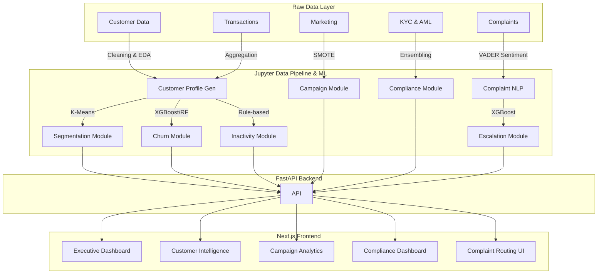

<div align="center">

# 📊 FinSight AI: Unified Customer Intelligence & Retention Analytics Platform

**An enterprise fintech analytics platform combining predictive machine learning, Natural Language Processing (NLP), and full-stack engineering to solve critical financial sector challenges including churn prevention, compliance monitoring, and customer support operations.**

[🚀 Project Overview](#project-overview) · [💼 Business Problems Solved](#business-problems-solved) · [🏛️ System Architecture](#system-architecture) · [🗄️ Datasets](#datasets-section) · [🧠 Modules](#modules) · [💻 Local Setup](#local-setup)

</div>

---

## 🎯 PROJECT OVERVIEW

FinSight AI simulates the advanced data analytics infrastructure of a modern, top-tier financial institution (similar to American Express or Chase). By leveraging massive datasets, machine learning, Natural Language Processing (NLP), and a modern React/FastAPI stack, this unified intelligence platform completely modernizes customer lifecycle management.

Rather than relying on siloed data systems, FinSight AI combines multiple independent analytics engines into a single **Unified Intelligence Platform**. This enables cross-functional data synthesis across:
* **Customer Lifecycle Management**: Tracking customers from acquisition through daily usage to long-term loyalty.
* **Customer Retention & Churn Prevention**: Proactively identifying at-risk customers before they close their accounts.
* **Campaign Optimization**: Targeting the right customers with the right marketing messages at the right time.
* **Compliance Monitoring**: Automating Anti-Money Laundering (AML) and Know Your Customer (KYC) risk detection.
* **Complaint Intelligence**: Utilizing NLP (NLTK VADER) and rule-based systems to resolve customer grievances.
* **Executive Decision Support**: Providing C-suite leadership with a real-time, interactive Next.js dashboard of portfolio health.

---

## 💼 BUSINESS PROBLEMS SOLVED

Financial institutions lose billions annually due to fragmented data and reactive strategies. FinSight AI addresses six critical challenges:

### 1. Customer Churn
* **Why it matters:** Acquiring a new credit card customer costs 5-25x more than retaining an existing one.
* **Financial impact:** Millions lost in future revolving interest and swipe fees.
* **How FinSight solves it:** Trains XGBoost and Random Forest models on historical behavioral data to predict churn probability, allowing the retention team to intervene proactively.

### 2. Customer Inactivity
* **Why it matters:** "Silent attrition" occurs when a customer stops using their card but leaves the account open.
* **Financial impact:** Dead capital in unused credit lines and zero swipe revenue.
* **How FinSight solves it:** Activity scoring models flag customers exhibiting early signs of dormancy based on transaction frequency and volume drops, triggering re-engagement workflows.

### 3. Poor Campaign Performance
* **Why it matters:** Blanket marketing campaigns have abysmal conversion rates and annoy customers.
* **Financial impact:** Wasted marketing spend and high customer fatigue.
* **How FinSight solves it:** ML models predict the likelihood of conversion based on past interactions and demographics, optimizing target lists and preferred communication channels.

### 4. KYC Compliance Challenges
* **Why it matters:** Regulators heavily penalize banks for facilitating money laundering or doing business with sanctioned entities.
* **Financial impact:** Fines in the hundreds of millions, plus severe reputational damage.
* **How FinSight solves it:** Analyzes transaction patterns, country risks, and entity opacity to assign real-time risk tiers (Low, Medium, High, Critical), immediately flagging Politically Exposed Persons (PEPs) or OFAC matches.

### 5. Customer Complaint Escalation
* **Why it matters:** Unresolved complaints escalate to regulatory bodies like the CFPB, incurring legal costs.
* **Financial impact:** Legal fees, fines, and brand degradation.
* **How FinSight solves it:** An NLP pipeline classifies incoming complaints, detects emotional distress using VADER sentiment analysis, predicts the likelihood of escalation, and automatically routes high-risk cases to priority teams.

### 6. Lack of Customer Segmentation
* **Why it matters:** Treating all customers equally ignores vast differences in profitability and risk.
* **Financial impact:** Inefficient resource allocation.
* **How FinSight solves it:** K-Means clustering algorithmically groups customers into distinct personas (e.g., "Premium Customers", "Deal Hunters"), allowing tailored product offerings.

---

## 🏛️ SYSTEM ARCHITECTURE

FinSight AI employs a highly modular, decoupled architecture. Data flows from raw CSVs through Jupyter Notebook pipelines into a PostgreSQL database, which is then served by a FastAPI backend to an interactive Next.js (React 19) presentation layer.



### Data Flow & Module Interoperability
While the **Campaign Analytics**, **Compliance Analytics**, and **Complaint Intelligence** modules operate largely independently on specialized datasets, the **Customer Intelligence** and **Segmentation** modules share inputs and outputs. A final pipeline merges segmentation labels, churn probabilities, and inactivity scores into a singular `unified_customer_profile` served to the Executive Dashboard.

---

## 🗄️ DATASETS SECTION

The platform is fueled by 7 highly realistic financial datasets, totaling over 1.4 million records.

### DATASET 1: Credit Card Customer Dataset
* **Purpose:** Core demographic and behavioral data for retention analysis.
* **Features:**
  * `CLIENTNUM`: Unique identifier.
  * `Customer_Age`, `Income_Category`, `Gender`, `Marital_Status`: Demographics.
  * `Card_Category`: Tier (Blue, Silver, Gold, Platinum).
  * `Months_on_book`: Tenure with the bank.
  * `Months_Inactive_12_mon`: Silent attrition indicator.
  * `Total_Trans_Amt`, `Total_Trans_Ct`, `Avg_Utilization_Ratio`: Engagement metrics.
  * `Attrition_Flag`: Target variable (Attrited Customer vs. Existing Customer).
* **Usage:** Base dataset for Customer Segmentation, Churn Prediction, and Unified Profiling. Expected output is a 0-1 churn probability and a segment label per customer.

### DATASET 2: Credit Card Transaction Dataset
* **Purpose:** Micro-level transaction logs to detect spending patterns and fraud.
* **Features:**
  * `trans_date_trans_time`, `amt`: Timestamp and transaction amount.
  * `merchant`, `category`: Spend destination and type.
  * `city`, `state`, `job`: Geographic and occupational indicators.
  * `is_fraud`: Target indicator for anomalous transactions.
* **Usage:** Provides granular activity monitoring, geographical spending heatmaps, and baseline data for inactivity detection models.

### DATASET 3: Bank Marketing Campaign Dataset
* **Purpose:** Logs of telemarketing outreach to predict product uptake (e.g., term deposits).
* **Features:**
  * `campaign`: Number of contacts performed during this campaign.
  * `previous`: Number of contacts performed before this campaign.
  * `pdays`: Number of days that passed by after the client was last contacted.
  * `poutcome`: Outcome of the previous marketing campaign.
  * `y`: Target variable (Did the client subscribe? yes/no).
* **Usage:** Analyzes campaign fatigue and predicts conversion. Because direct marketing datasets are often heavily imbalanced, this module heavily utilizes SMOTE (Synthetic Minority Over-sampling Technique).

### DATASET 4: KYC Compliance Dataset (Part 1 & 2)
* **Purpose:** Merged data containing transaction flags and entity risk profiles for AML monitoring.
* **Features:**
  * `sector_risk`, `country_risk`: Macro-level risk indicators.
  * `pep_flag`: Politically Exposed Person indicator.
  * `sanctions_flag`: Entity matches against global watchlists.
  * `transaction_anomaly`, `structuring_pattern_flag`: Micro-level behavioral alerts (e.g., smurfing).
* **Usage:** Trains composite models to output a unified AML Risk Score, classifying customers into monitoring tiers.

### DATASET 5: CFPB Complaint Dataset
* **Purpose:** Unstructured text data of consumer grievances filed with the Consumer Financial Protection Bureau.
* **Features:**
  * `consumer_complaint_narrative`: Raw text of the complaint.
  * `product`, `issue`, `sub_issue`: Bureaucratic classifications.
  * `company_response`, `timely_response`: Resolution tracking.
* **Usage:** Powers the NLP layer. Analyzed to detect severe emotional distress and predict regulatory escalation.

---

## 🧠 MODULES

### MODULE 1: CUSTOMER CHURN PREDICTION
* **Business Objective:** Identify customers likely to cancel their credit cards within the next 90 days.
* **Features Used:** Total transaction count, utilization ratio, revolving balance, inactivity months.
* **Target Variable:** `Attrition_Flag` (Binary: 1=Churn, 0=Retain).
* **Models Evaluated:** Logistic Regression, Random Forest, XGBoost.
* **Outputs:** XGBoost provided the highest ROC-AUC. It generates a continuous `churn_probability` score (0.0 to 1.0). Business teams use this to trigger automated retention offers (e.g., waived annual fees) for accounts crossing the 0.70 threshold.

### MODULE 2: RETENTION CAMPAIGN ANALYTICS
* **Business Objective:** Maximize the ROI of marketing outreach while minimizing customer fatigue.
* **Insights Generated:**
  * **Campaign Success Rate:** Baseline conversion benchmarking.
  * **Conversion Prediction:** XGBoost + SMOTE model identifies high-propensity targets.
  * **Segment & Channel Optimizations:** Identifies the highest converting job sectors and the optimal contact method (cellular vs. telephone).
  * **Fatigue Analysis:** Correlates the `campaign` (number of calls) metric against conversion drop-off.

### MODULE 3: USAGE & INACTIVITY ANALYSIS
* **Business Objective:** Prevent "silent attrition" by detecting plummeting engagement.
* **Mechanism:** Analyzes `Days since last transaction`, `Transaction frequency`, and utilization drops.
* **Outputs:** Generates an `Activity Score` (0 to 1) using MinMaxScaler and weighted rules. Customers with high inactivity (>3 months) and low utilization (<15%) are flagged on a **Future Churn Watchlist** for immediate re-engagement campaigns.

### MODULE 4: KYC COMPLIANCE ANALYTICS
* **Business Objective:** Automate the detection of illicit financial behavior to satisfy regulatory requirements.
* **Risk Categories:**
  * **Critical (>0.75):** Immediate freeze and compliance review (e.g., Sanctions match).
  * **High Risk (0.50-0.75):** Enhanced Due Diligence required (e.g., PEP status + High-Risk Country).
  * **Medium Risk (0.25-0.50):** Schedule periodic 30-day review.
  * **Low Risk (<0.25):** Standard automated monitoring.

### MODULE 5: CUSTOMER ESCALATION & SUPPORT INTELLIGENCE
* **Business Objective:** Triage customer support tickets to prevent legal action or regulatory fines.
* **Mechanism:** An XGBoost model predicts escalation based on complaint category, product type, and narrative length, identifying tickets that require immediate supervisor intervention.

### MODULE 6: CUSTOMER SEGMENTATION
* **Business Objective:** Move away from one-size-fits-all marketing by discovering natural customer cohorts.
* **Mechanism:** K-Means Clustering (k=5) utilizing credit limit, transaction count, and balances.
* **Expected Segments:**
  * 🏆 **Premium Customers:** High credit limit, massive spend. (Target for luxury travel rewards).
  * 🛒 **Daily Spenders:** High transaction frequency, low average ticket. (Target for cashback).
  * 🎯 **Deal Hunters:** Low revolving balance, moderate activity. (Pay in full, target for promotional APRs).
  * ⚠️ **At-Risk Customers:** High inactivity months.
  * 😴 **Silent Users:** Lowest overall engagement.

---

## 🧠 NLP SENSITIVITY LAYER

Traditional keyword matching is insufficient for complex financial complaints. FinSight AI integrates **NLTK VADER Sentiment Analysis** to deeply understand unstructured `consumer_complaint_narrative` text.
* **Summarization:** Distills 500-word rants into clean summaries using rule-based extraction for agent dashboards.
* **Classification:** Maps raw text to precise financial categories (e.g., "Billing", "Fraud") using heuristic pattern matching.
* **Emotion Detection:** Extracts the dominant psychological state by analyzing compound sentiment scores, specifically hunting for high-risk flags like **"Legal Threat"** or **"Anger"**.

---

## ⚡ AUTOMATED ROUTING LAYER

Moving beyond passive analysis, FinSight features an automated **Complaint Routing Pipeline**.

**Workflow Pipeline:**
1. **Input:** Raw customer complaint text enters the system.
2. **NLP Nodes:** The pipeline autonomously calls the VADER layer to summarize, classify, and detect emotion.
3. **ML Node:** The state is passed to the XGBoost Escalation model to calculate an exact probability score.
4. **Decision Rule Node:** The system evaluates the state:
   * *If Emotion == "Legal Threat" or Prob > 0.90 ➔ Assign Priority: CRITICAL ➔ Route to: Legal/Compliance.*
   * *If Emotion == "Anger" and Prob > 0.60 ➔ Assign Priority: HIGH ➔ Route to: Priority Support.*
5. **Output:** A fully populated data object ready for the customer support dashboard.

---

## ⚙️ PROJECT WORKFLOW

1. **Data Collection:** Raw CSVs are loaded into the `data/raw/` directory.
2. **Data Cleaning & EDA:** Notebooks 01-05 clean nulls, handle outliers, and generate initial business insights.
3. **Feature Engineering:** Creation of scaling metrics, SMOTE balancing, and NLP encodings.
4. **Model Training:** Notebooks 06-12 train, evaluate (ROC-AUC, F1), and serialize `.pkl` models.
5. **NLP Processing:** Batch processing of text via VADER saves state to `data/processed/`.
6. **API Serving:** The FastAPI backend loads the data from PostgreSQL and models in memory, exposing RESTful endpoints.
7. **Dashboard Visualization:** Next.js polls the APIs and renders interactive Plotly visualizations.

---

## 🛠️ TECH STACK

* **Python 3.11+**: Core programming language.
* **Next.js 15 & React 19**: Frontend framework and UI library.
* **Tailwind CSS**: Custom Amex design system styling.
* **FastAPI**: Asynchronous web framework for exposing high-throughput REST APIs.
* **PostgreSQL**: Relational database leveraging complex SQL views (`v_executive_kpis`).
* **Pandas / NumPy**: High-performance data manipulation and mathematical operations.
* **Scikit-Learn**: Data scaling, K-Means clustering, and evaluation metrics.
* **XGBoost**: State-of-the-art gradient boosting for tabular classification tasks.
* **NLTK VADER**: Underpinning architecture for Natural Language Processing and sentiment tasks.
* **Plotly**: Advanced, interactive JavaScript-based graphing library (embedded as static PNGs in Jupyter).

---

## 💻 LOCAL SETUP

Want to run this massive platform locally? Follow these steps:

### 1. Start the PostgreSQL Database
Ensure you have a PostgreSQL server running locally or via Docker with your financial data loaded into the `finsight` database. Ensure the SQL views in `sql/02_views.sql` have been executed.

### 2. Run the FastAPI Backend
```bash
# Navigate to the project root
cd FinSight-AI

# Install Python dependencies
pip install -r requirements.txt

# Start the FastAPI server
python -m uvicorn backend.main:app --reload --port 8000
```
*The backend will be live at http://localhost:8000.*

### 3. Run the Next.js Frontend
```bash
# Open a new terminal tab and navigate to the frontend
cd FinSight-AI/finsight-frontend

# Install Node dependencies
npm install

# Start the Next.js dev server
npm run dev
```
*The frontend dashboard will be live at http://localhost:3000.*

---

## 📂 FOLDER STRUCTURE

```text
FinSight-AI/
├── 📓 notebooks/                  # Step-by-step EDA, ML training, and NLP processing
│   ├── 01_data_understanding/     # EDA & cleaning (NB 01-05)
│   ├── 02_feature_engineering/    # Unified profile construction (NB 13)
│   ├── 03_customer_intelligence/  # Segmentation, inactivity, churn (NB 06-08)
│   ├── 04_campaign_analytics/     # Campaign prediction (NB 09)
│   ├── 05_compliance_intelligence/# KYC risk scoring (NB 10)
│   └── 06_complaint_intelligence/ # NLP sentiment & escalation (NB 11-12)
├── 🤖 src/                        # Production Python modules
│   ├── api/                       # FastAPI route modules by domain
│   ├── customer_intelligence/     # ML inference for segmentation and churn
│   ├── campaign_analytics/        # ML inference for marketing optimization
│   ├── compliance/                # Risk assessment and AML logic
│   ├── complaints/                # NLP wrappers and escalation inference
│   ├── common/                    # Logging, constants, and exceptions
│   ├── dashboard/                 # Backend data providers for the frontend
│   ├── pipelines/                 # Domain pipeline orchestrators
│   └── utils/                     # Data/model loaders and validators
├── 🌐 finsight-frontend/          # Next.js UI application
│   ├── src/app/                   # Next.js app router (pages and layouts)
│   ├── src/components/            # Reusable UI components (KPI cards, charts)
│   └── src/lib/                   # API clients and utilities
├── 📊 data/
│   ├── raw/                       # Original, immutable datasets
│   ├── interim/                   # Intermediate transformation outputs
│   ├── processed/                 # Cleaned datasets ready for training
│   ├── feature_store/             # Parquet files for fast API serving
│   └── sample_data/               # Small demo datasets (committed to Git)
├── 🧠 models/                     # Saved model artifacts (.pkl files)
├── ⚙️ configs/                    # YAML configuration files
├── 📐 architecture/               # System design documents and diagrams
├── 🧪 tests/                      # Unit, integration, and API tests
├── main.py                        # FastAPI application entry point
└── requirements.txt               # Dependency management
```

---

## 📓 NOTEBOOKS

* `01_customer_eda.ipynb` -> `05_complaint_eda.ipynb`: Cleans raw datasets, performs exploratory data analysis, and visualizes distributions using Plotly.
* `06_customer_segmentation.ipynb`: Trains K-Means clustering to create 5 distinct customer personas.
* `07_inactivity_detection.ipynb`: Builds rule-based and scaled scoring to identify silent attrition.
* `08_churn_prediction.ipynb`: Trains Logistic Regression, Random Forest, and XGBoost to output churn probability.
* `09_campaign_prediction.ipynb`: Addresses severe data imbalance with SMOTE, training an XGBoost conversion predictor.
* `10_kyc_risk_prediction.ipynb`: Ensembles transaction and entity risk flags into a unified AML risk score.
* `11_complaint_sentiment.ipynb`: Iterates over complaints with VADER NLP to generate summaries, classifications, and emotions.
* `12_escalation_prediction.ipynb`: Trains an XGBoost model on the newly generated NLP data to predict CFPB escalation.
* `13_unified_customer_profile.ipynb`: Joins multiple ML outputs into a single, master 360-degree customer view.

---

## 📈 DASHBOARDS

The presentation layer consists of 5 highly polished, interconnected pages:

1. **Executive Dashboard**: A C-suite overview featuring live platform KPIs, cross-module risk intelligence (e.g., Segment × Risk heatmaps), and high-level summaries.
2. **Customer Analytics**: Deep dives into churn probability distributions, PCA scatter plots of segments, and dynamic future-churn watchlists.
3. **Campaign Analytics**: Visualizes historical campaign success rates alongside an interactive "Campaign Predictor" form to score a customer's conversion likelihood in real-time.
4. **Compliance Analytics**: Displays AML/KYC risk breakdowns, flags high-risk entities, and features an interactive KYC predictor tool.
5. **Complaint Analytics**: Showcases the NLP capabilities, mapping emotions against complaint categories, and features an automated routing UI for real-time ticket triage.

---

## 🏆 FINAL DELIVERABLES & BUSINESS VALUE

This platform delivers a complete, end-to-end blueprint for modern financial intelligence. 

**Business Value Delivered:**
* Transitioned from reactive customer support to predictive, NLP-driven escalation prevention.
* Replaced blanket marketing with precision, ML-targeted campaigns, reducing customer fatigue.
* Unified fragmented risk, demographic, and behavioral data into actionable executive insights.

**Future Enhancements:**
* Integration of real-time streaming data via Apache Kafka for instant transaction scoring.
* Implementing advanced deep learning techniques (like BERT) for even finer sentiment granularity.
* Expanding the PostgreSQL persistence layer via SQLAlchemy for enterprise-scale data storage.

</div>
