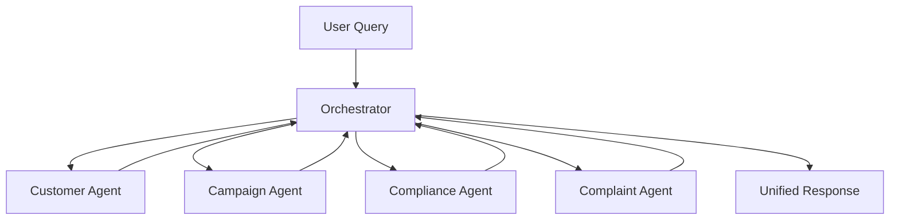

# Agent Orchestrator

## Purpose
Coordinates multiple domain-specific agents to handle complex, cross-functional queries.

## Architecture

## Current Implementation
The orchestrator currently dispatches to the complaint agent directly.
Future versions will implement query classification and multi-agent routing.

## Entry Point
- `src/agents/orchestrator.py`
