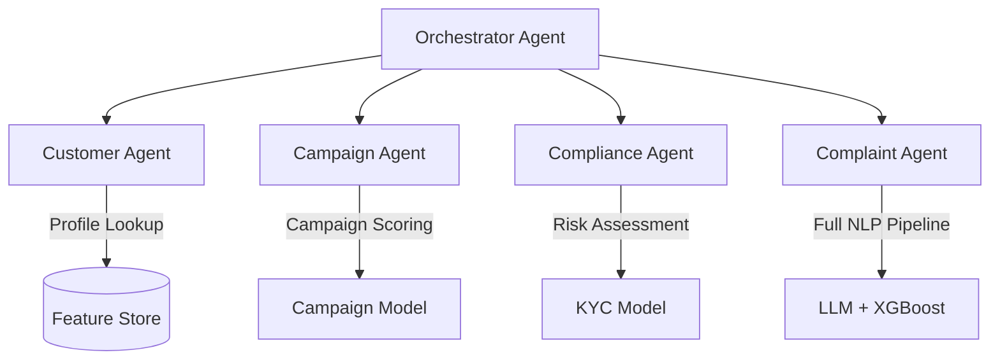

# Agent Architecture

## Overview

FinSight AI implements an autonomous **Complaint Routing Agent** using LangGraph — a framework for building stateful, multi-step LLM applications. The agent processes raw customer complaint narratives through a deterministic pipeline of NLP analysis, ML scoring, business rule application, and generative response drafting.

---

## LangGraph State Machine

```mermaid
stateDiagram-v2
    [*] --> Summarize
    Summarize --> Classify
    Classify --> DetectEmotion
    DetectEmotion --> ScoreEscalation
    ScoreEscalation --> Route
    Route --> GenerateResponse
    GenerateResponse --> [*]

    state Summarize {
        [*] --> LLM_Summarize: Raw narrative
        LLM_Summarize --> [*]: 1-2 sentence summary
    }

    state Classify {
        [*] --> LLM_Classify: Full text
        LLM_Classify --> [*]: Category label
    }

    state DetectEmotion {
        [*] --> LLM_Emotion: Full text
        LLM_Emotion --> [*]: Emotional state
    }

    state ScoreEscalation {
        [*] --> XGBoost_Model: Encoded features
        XGBoost_Model --> [*]: Probability score
    }

    state Route {
        [*] --> BusinessRules: Score + Emotion
        BusinessRules --> [*]: Priority + Team
    }

    state GenerateResponse {
        [*] --> LLM_Response: Full context
        LLM_Response --> [*]: Draft response
    }
```



---

## State Schema

The agent maintains a `ComplaintState` TypedDict that flows through all nodes:

```python
class ComplaintState(TypedDict):
    narrative: str                # Input: raw complaint text
    summary: str                  # Node 1 output
    category: str                 # Node 2 output
    emotion: str                  # Node 3 output
    escalation_probability: float # Node 4 output
    priority_level: str           # Node 5 output
    assigned_team: str            # Node 5 output
    recommended_action: str       # Node 5 output
    suggested_response: str       # Node 6 output
```

---

## Node Descriptions

### Node 1: Summarize
- **Type**: LLM (Gemini / GPT)
- **Input**: `narrative` (raw text, often 200-500 words)
- **Output**: `summary` (1-2 concise sentences)
- **Purpose**: Reduce noise for downstream classification accuracy

### Node 2: Classify
- **Type**: LLM (Gemini / GPT)
- **Input**: `narrative`
- **Output**: `category` (e.g., "Billing", "Fraud", "Account Management")
- **Purpose**: Map unstructured text to a finite set of business categories

### Node 3: Detect Emotion
- **Type**: LLM (Gemini / GPT)
- **Input**: `narrative`
- **Output**: `emotion` (e.g., "Frustration", "Anger", "Distress", "Legal Threat")
- **Purpose**: Identify high-risk emotional signals that require priority handling

### Node 4: Score Escalation
- **Type**: XGBoost ML Model
- **Input**: Encoded `category`, `emotion`, `word_count`
- **Output**: `escalation_probability` (0.0–1.0)
- **Purpose**: Quantify the likelihood that this complaint escalates to a regulatory body

### Node 5: Route (Business Rules)
- **Type**: Deterministic rules engine
- **Logic**:

| Condition | Priority | Team | Action |
|-----------|----------|------|--------|
| `prob > 0.90` | CRITICAL | Supervisor | Notify supervisor immediately |
| `prob > 0.80` | HIGH | Priority Support | Escalate to senior agent |
| `emotion ∈ {Legal Threat, Distress}` | CRITICAL | Legal Compliance | Escalate to compliance |
| `emotion == Anger AND prob > 0.60` | HIGH | Priority Support | Immediate callback |
| Default | STANDARD | General Support | Standard resolution |

### Node 6: Generate Response
- **Type**: LLM (Gemini / GPT)
- **Input**: Full state context (category, emotion, priority)
- **Output**: `suggested_response` (professional, empathetic draft)
- **Fallback**: Hardcoded response if LLM call fails

---

## Agent Network (Future State)

The current implementation features a single complaint agent. The architecture supports expansion to a multi-agent network:



Each agent in the `agents/` directory contains:
- `system_prompt.md` — Agent persona and constraints
- `tools.py` — Available tool functions
- `workflow.py` — LangGraph state machine definition
- `README.md` — Agent documentation

---

## Error Handling & Resilience

1. **LLM Fallback**: If the LLM API call fails, hardcoded safe responses are returned
2. **Model Loading**: Singleton pattern with lazy initialization prevents cold-start failures
3. **State Immutability**: Each node receives and returns a full state copy
4. **Timeout Protection**: API-level timeout enforcement on the `/api/complaints/process` endpoint
