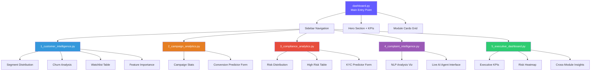
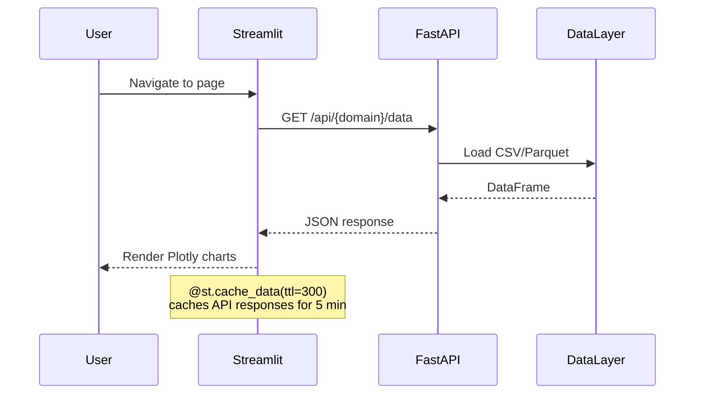

# Dashboard Architecture

## Overview

The FinSight AI frontend is a multi-page Streamlit application serving as the primary user interface for enterprise analytics. It follows a modular page-based architecture where each analytics domain has its own dedicated view.

---

## Component Hierarchy

---

## Page Specifications

### Home Dashboard (`dashboard.py`)
- **Purpose**: Landing page with platform overview and navigation
- **Data Sources**: `/api/customers/kpis`
- **Components**: Hero section, Live KPI strip, Module cards grid, Tech stack, Dataset summary

### Page 1: Customer Intelligence
- **Purpose**: Deep dive into customer behavior, segmentation, and churn risk
- **Data Sources**: `/api/customers/segments`, `/api/customers/churn/*`, `/api/customers/watchlist`
- **Key Visualizations**:
  - K-Means segment distribution (Plotly pie/bar)
  - Churn probability histogram
  - Segment profile comparison table
  - XGBoost feature importance bar chart
  - Future churn watchlist with risk badges

### Page 2: Campaign Analytics
- **Purpose**: Marketing campaign performance and conversion prediction
- **Data Sources**: `/api/campaign/stats`, `/api/campaign/predict`
- **Key Visualizations**:
  - Campaign success rate metrics
  - Channel effectiveness comparison
  - Interactive conversion predictor form

### Page 3: Compliance Analytics
- **Purpose**: KYC/AML risk monitoring and entity risk assessment
- **Data Sources**: `/api/compliance/risk/*`
- **Key Visualizations**:
  - Risk tier distribution (pie chart)
  - High-risk entity table with PEP/sanctions flags
  - Interactive KYC risk predictor form

### Page 4: Complaint Intelligence
- **Purpose**: NLP analysis results and live AI agent interface
- **Data Sources**: `/api/complaints/process`
- **Key Visualizations**:
  - Emotion × Category heatmap
  - Escalation probability distribution
  - Live AI Agent: text input → real-time LangGraph processing → structured output

### Page 5: Executive Dashboard
- **Purpose**: C-suite overview with cross-module risk intelligence
- **Data Sources**: All API endpoints aggregated
- **Key Visualizations**:
  - Platform-wide KPI cards
  - Segment × Churn Risk heatmap
  - Cross-module risk correlation

---

## Data Refresh Pattern

---

## Styling Architecture

All pages inject shared CSS via `frontend/utils/styles.py`:

| Component | Style Feature |
|-----------|--------------|
| KPI Cards | Gradient backgrounds, animated borders |
| Risk Badges | Color-coded (Critical=red, High=orange, Standard=green) |
| Section Headers | Gradient text with subtle separators |
| Module Cards | Hover effects, glassmorphism borders |
| Tables | Alternating row colors, sticky headers |
