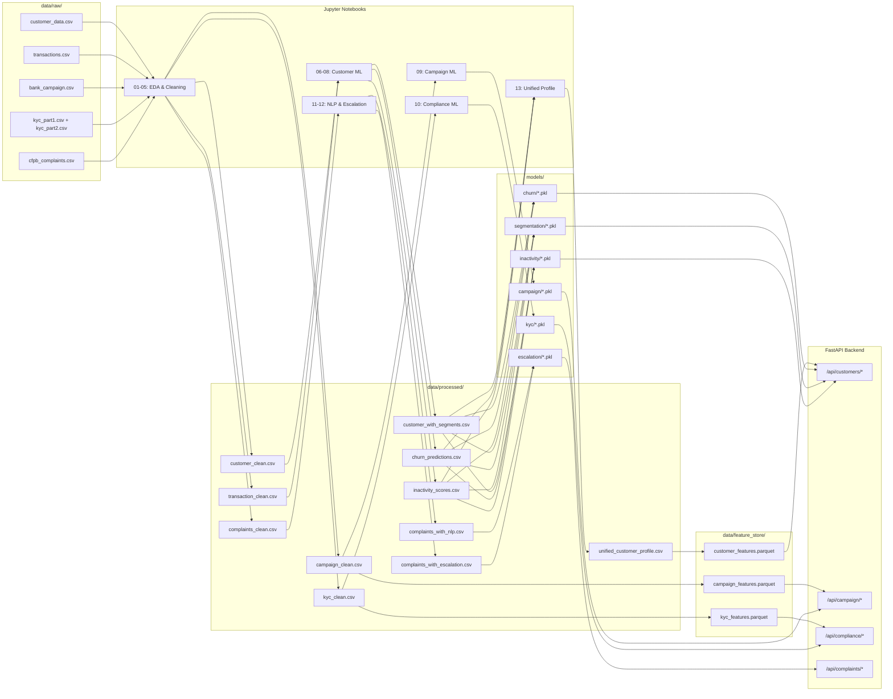

# Data Flow Architecture

## Overview

FinSight AI processes data through a 4-stage pipeline: **Raw → Interim → Processed → Feature Store**. This design enforces data immutability at the source, enables reproducible transformations, and optimizes serving latency.

---

## End-to-End Data Flow

---

## Data Layer Definitions

### 1. Raw Layer (`data/raw/`)
- **Purpose**: Original, immutable source files. Never modified after initial ingestion.
- **Contents**: CSV files organized by domain (`customer/`, `transactions/`, `campaigns/`, `kyc/`, `complaints/`)
- **Governance**: Files are gitignored to prevent large binary commits. Structure tracked via `.gitkeep`.

### 2. Interim Layer (`data/interim/`)
- **Purpose**: Intermediate outputs during multi-step transformations.
- **Example Use**: Merging `kyc_part1.csv` + `kyc_part2.csv` before full cleaning.
- **Lifecycle**: Temporary — may be regenerated from raw data at any time.

### 3. Processed Layer (`data/processed/`)
- **Purpose**: Clean, ML-ready datasets. The primary input for model training.
- **Key Outputs**:

| File | Source Notebook | Records | Description |
|------|----------------|---------|-------------|
| `customer_clean.csv` | NB 01 | 10,127 | Cleaned demographics + behavior |
| `transaction_clean.csv` | NB 02 | 1,296,675 | Deduplicated transactions |
| `campaign_clean.csv` | NB 03 | 100 | Marketing campaign outcomes |
| `kyc_clean.csv` | NB 04 | 52,000 | Merged KYC entity + transaction data |
| `complaints_clean.csv` | NB 05 | 24,665 | Filtered CFPB narratives |
| `customer_with_segments.csv` | NB 06 | 10,127 | K-Means cluster labels |
| `churn_predictions.csv` | NB 08 | 10,127 | Churn probabilities |
| `inactivity_scores.csv` | NB 07 | 10,127 | Activity scores |
| `complaints_with_nlp.csv` | NB 11 | 24,665 | LLM sentiment + classification |
| `complaints_with_escalation.csv` | NB 12 | 24,665 | Escalation probabilities |
| `unified_customer_profile.csv` | NB 13 | 10,127 | 360° merged customer view |

### 4. Feature Store (`data/feature_store/`)
- **Purpose**: Optimized Parquet files for low-latency API serving.
- **Format**: Apache Parquet (columnar, compressed) for fast selective reads.
- **Files**: `customer_features.parquet`, `campaign_features.parquet`, `kyc_features.parquet`

---

## Data Lineage Rules

1. **Immutability**: Raw data is never modified. All transformations produce new files.
2. **Reproducibility**: Any processed file can be regenerated by re-running its source notebook.
3. **Traceability**: Each processed file maps to exactly one notebook that created it.
4. **Separation**: Training data (processed/) is separate from serving data (feature_store/).
