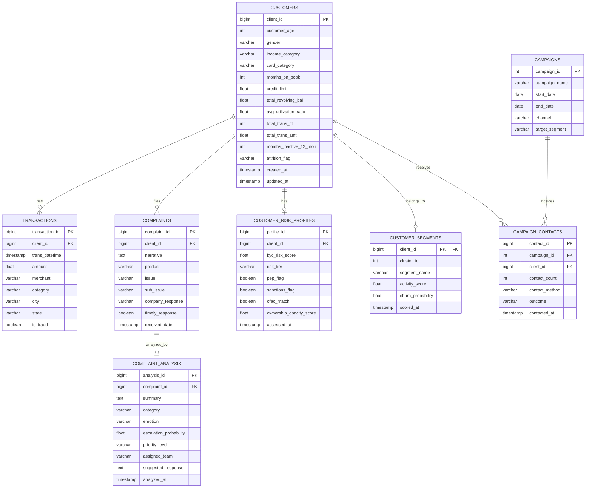

# Database Schema

## Overview

While the current implementation uses CSV/Parquet files for data storage, the system is designed for migration to PostgreSQL. This document defines the production database schema.

---

## Entity Relationship Diagram



---

## Table Descriptions

| Table | Purpose | Est. Rows |
|-------|---------|-----------|
| `customers` | Core customer demographics and behavioral metrics | 10,127 |
| `transactions` | Individual transaction records | 1,296,675 |
| `customer_segments` | ML-derived segment labels and scores | 10,127 |
| `customer_risk_profiles` | KYC/AML risk assessments | 52,000 |
| `campaigns` | Marketing campaign definitions | ~50 |
| `campaign_contacts` | Individual customer-campaign interactions | ~100 |
| `complaints` | Raw customer complaint records | 24,665 |
| `complaint_analysis` | AI-generated analysis results | 24,665 |

---

## Indexes

```sql
-- High-frequency lookup patterns
CREATE INDEX idx_customers_attrition ON customers(attrition_flag);
CREATE INDEX idx_segments_name ON customer_segments(segment_name);
CREATE INDEX idx_risk_tier ON customer_risk_profiles(risk_tier);
CREATE INDEX idx_complaints_product ON complaints(product);
CREATE INDEX idx_analysis_priority ON complaint_analysis(priority_level);
CREATE INDEX idx_transactions_client ON transactions(client_id);
CREATE INDEX idx_transactions_fraud ON transactions(is_fraud);
```

---

## Migration Path

The current CSV-based implementation maps directly to this schema:

| CSV File | Target Table |
|----------|-------------|
| `customer_clean.csv` | `customers` |
| `transaction_clean.csv` | `transactions` |
| `customer_with_segments.csv` | `customer_segments` |
| `kyc_clean.csv` | `customer_risk_profiles` |
| `campaign_clean.csv` | `campaigns` + `campaign_contacts` |
| `complaints_clean.csv` | `complaints` |
| `complaints_with_escalation.csv` | `complaint_analysis` |
