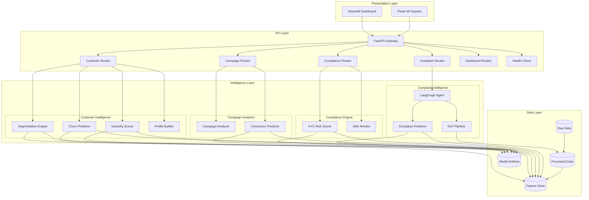

# System Architecture

## Overview

FinSight AI is a modular, layered fintech analytics platform designed around **Domain-Driven Design (DDD)** principles. Each business domain (Customer Intelligence, Campaign Analytics, Compliance, Complaint Intelligence) operates as an independent module with its own data processing, ML models, and API surface.

---

## High-Level Architecture

---

## Layer Responsibilities

### 1. Presentation Layer
- **Streamlit Dashboard**: Interactive, real-time analytics interface with 5 specialized pages
- **Power BI**: Enterprise reporting exports stored in `dashboards/`
- Communicates exclusively via REST API calls to the backend

### 2. API Layer (FastAPI)
- **Gateway Pattern**: Single entry point (`main.py`) with domain-specific routers
- **RESTful Design**: Resource-oriented endpoints with proper HTTP methods
- **Middleware**: CORS, error handling, request logging
- **Health Checks**: `/api/health` for load balancer integration

### 3. Intelligence Layer
- **Domain Isolation**: Each module encapsulates its own business logic, models, and data access
- **Model Serving**: Pre-trained models loaded into memory at startup via `joblib`
- **Agent Orchestration**: LangGraph state machine for autonomous complaint processing

### 4. Data Layer
- **Immutable Raw Data**: Original CSVs never modified
- **Processed Data**: Cleaned, transformed datasets ready for modeling
- **Feature Store**: Parquet files for low-latency feature serving
- **Model Registry**: Serialized `.pkl` artifacts organized by domain

---

## Technology Stack Matrix

| Layer | Technology | Purpose |
|-------|-----------|---------|
| Frontend | Streamlit 1.28+ | Interactive dashboards |
| API | FastAPI 0.104+ | Async REST API |
| ML | XGBoost, scikit-learn | Predictive models |
| NLP | LangChain, Gemini/GPT | Text analysis |
| Agents | LangGraph | Autonomous workflows |
| Database | PostgreSQL (SQLAlchemy) | Production persistence |
| Serialization | Parquet, joblib | Feature & model storage |
| Container | Docker, Docker Compose | Deployment |

---

## Scalability Considerations

1. **Horizontal Scaling**: Stateless API design allows multiple uvicorn workers
2. **Model Caching**: Singleton pattern prevents redundant model loading
3. **Feature Store**: Parquet columnar format enables fast selective reads
4. **Agent Isolation**: LangGraph state machines are independent per request
5. **Database Ready**: SQLAlchemy ORM prepared for PostgreSQL migration from CSV
