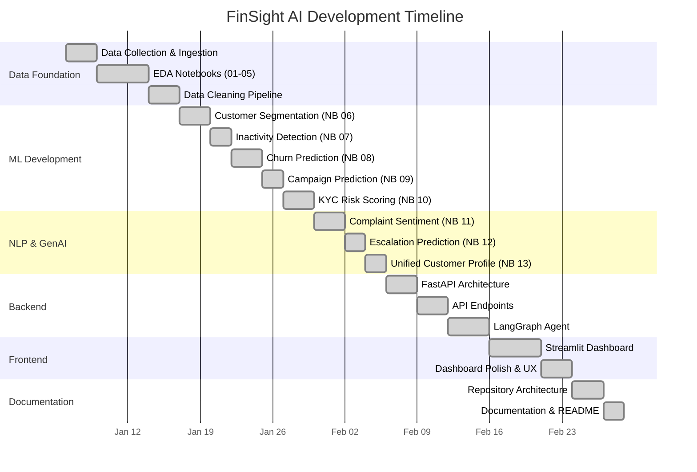

# Project Plan

## Overview

FinSight AI was developed in 7 sprints following an Agile methodology. Each sprint delivered a functional increment of the platform.

---

## Sprint Timeline

---

## Sprint Deliverables

### Sprint 1: Data Foundation
- **Goal**: Ingest and clean all 7 datasets
- **Deliverables**: 5 EDA notebooks, 5 cleaned CSV files
- **Key Metrics**: 1.4M+ records processed

### Sprint 2: Customer ML
- **Goal**: Build customer intelligence models
- **Deliverables**: K-Means segmentation, inactivity scoring, churn prediction
- **Key Metrics**: XGBoost churn ROC-AUC achieved

### Sprint 3: Domain ML
- **Goal**: Campaign and compliance models
- **Deliverables**: Campaign conversion predictor (SMOTE), KYC risk scorer
- **Key Metrics**: Multi-model ensemble for KYC risk

### Sprint 4: NLP & Profile Unification
- **Goal**: Process complaints with LLMs, build unified profile
- **Deliverables**: Sentiment analysis, escalation prediction, 360° customer view
- **Key Metrics**: 24,665 complaints processed through NLP pipeline

### Sprint 5: Backend
- **Goal**: Production API layer
- **Deliverables**: FastAPI with 15+ endpoints, LangGraph complaint agent
- **Key Metrics**: Sub-second response times on cached data

### Sprint 6: Frontend
- **Goal**: Interactive analytics dashboard
- **Deliverables**: 5-page Streamlit application with Plotly visualizations
- **Key Metrics**: All 6 analytics domains visualized

### Sprint 7: Documentation
- **Goal**: Enterprise-grade repository structure
- **Deliverables**: Full documentation suite, architecture diagrams, deployment configs
